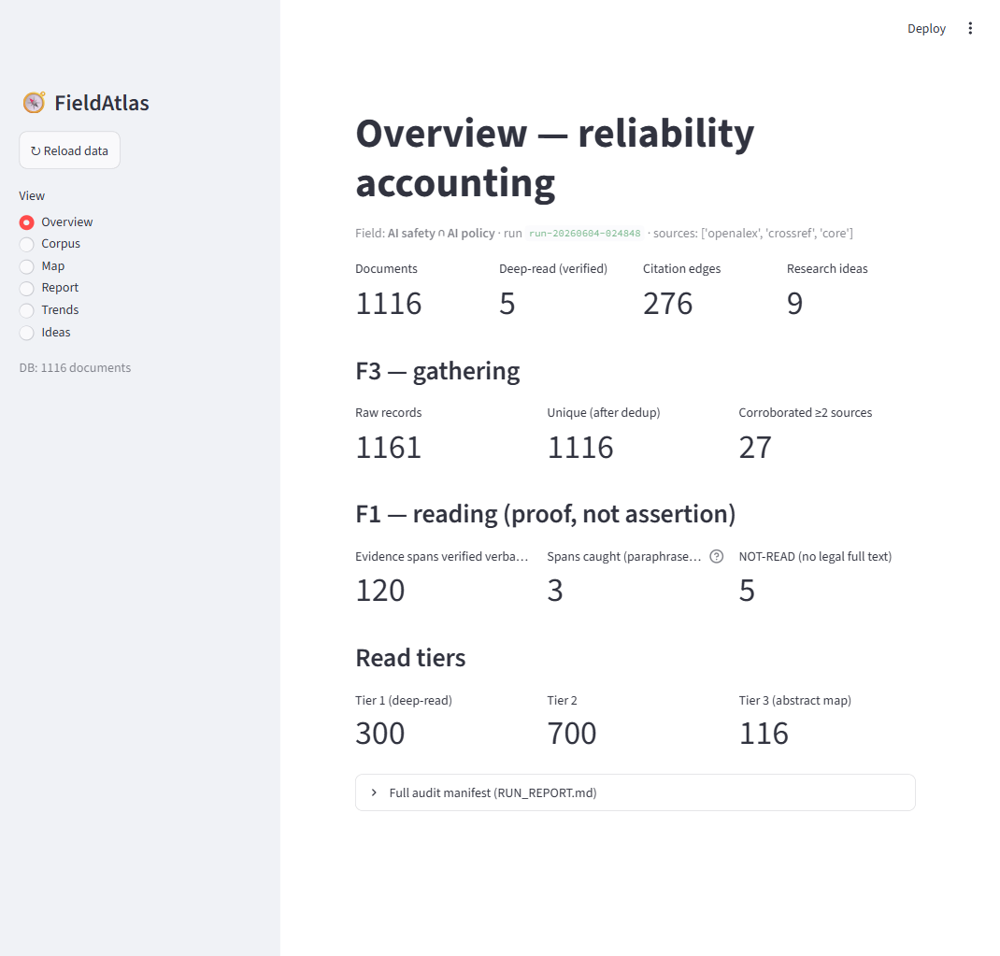
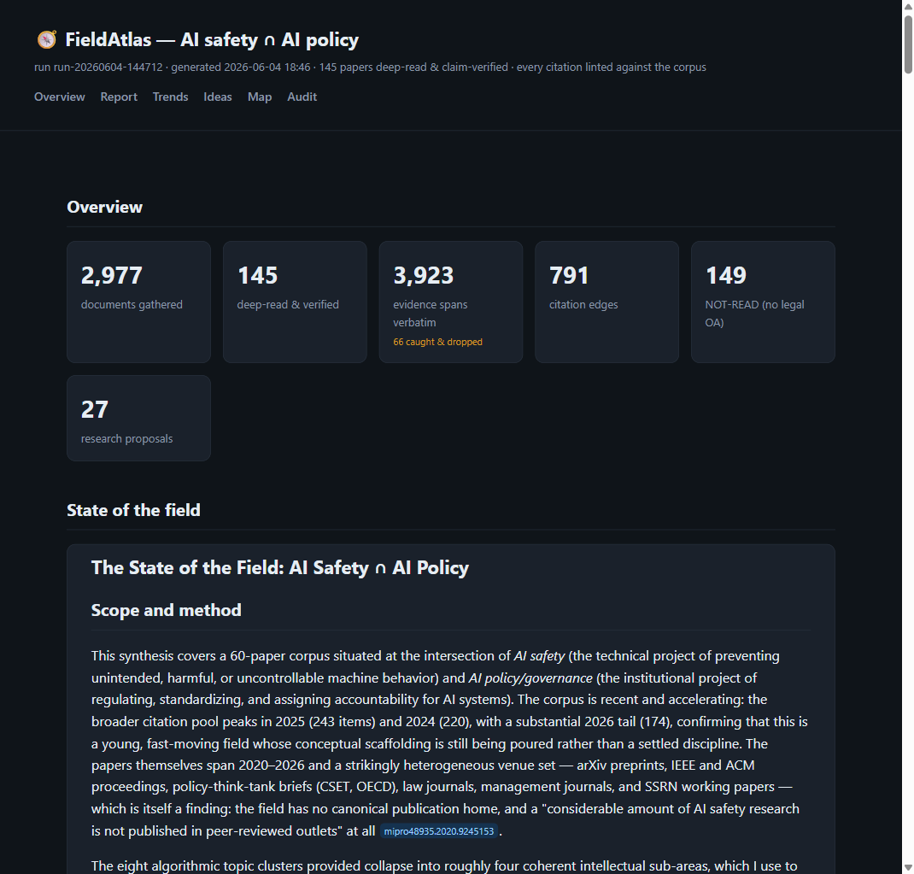

# FieldAtlas

A robust, reliable, automated **literature-review + research-ideation** system for the
**AI-safety ∩ AI-policy** field. Built to fix three real failure modes of naive LLM
"research": (F1) claiming to read what it didn't, (F2) fabricating references, (F3)
failing to gather the full literature.

**Design spec:** [`docs/superpowers/specs/2026-06-04-fieldatlas-design.md`](docs/superpowers/specs/2026-06-04-fieldatlas-design.md)

## The core idea

Three jobs an LLM cannot be trusted with are moved **out of the model** into deterministic,
auditable Python that sits on the boundary every model output must cross:

| Failure | Guardrail (deterministic) | Code |
|---|---|---|
| F1 fake reading | **Evidence-span verifier** — every recorded claim carries a verbatim quote that is string-matched back into the parsed full text; any miss rejects the extraction | `fieldatlas/verify.py` |
| F2 fabricated refs | **Citation linter** — outputs may cite only `[[canonical_id]]`s that exist in the corpus; grounded claims need a verified span | `fieldatlas/lint.py` |
| F3 incomplete gathering | **Multi-source harvest + dedup + recall manifest** — real scholarly APIs, cross-source dedup, completeness shown as data | `fieldatlas/harvest.py`, `dedup.py` |

The LLM only reads, synthesizes, and ideates over **already-verified** inputs.

## Two planes

- **Plane 1 — deterministic data layer** (this package, Python + SQLite, no LLM):
  harvest → dedup → rank (local ONNX embeddings) → acquire OA full text → parse →
  **verify** extractions → **lint** artifacts → manifest.
- **Plane 2 — reasoning layer** (Claude Code workflows in `fieldatlas/workflows/`):
  deep-read+extract, synthesis, trends, and the multi-agent idea engine — all gated by Plane 1.

## Setup

```powershell
py -3.12 -m venv .venv
.venv\Scripts\python -m pip install -r requirements.txt
# put your keys in .env (gitignored): CORE_API_KEY, OPENALEX_API_KEY, CONTACT_EMAIL,
# optional SEMANTIC_SCHOLAR_API_KEY, FIRECRAWL_API_KEY
```

## Run (end to end)

```powershell
# 1. Plane 1: harvest -> rank -> tier -> acquire -> parse -> queue (deterministic)
.venv\Scripts\python scripts\run_plane1.py 40 10          # per_query_limit, max_acquire

# 2. Plane 2: deep-read the queued papers (Claude Code Workflow over work/deepread_queue.json)
#    -> write the returned extractions to work/extractions_raw.json, then:
.venv\Scripts\python scripts\ingest_extractions.py        # VERIFY spans, write to DB

# 3. Map + synthesis + ideas
.venv\Scripts\python scripts\build_map.py
.venv\Scripts\python scripts\make_synth_args.py           # -> work/synth_args.json
#    run the synth Workflow with those args -> work/plane2_outputs.json, then:
.venv\Scripts\python scripts\build_outputs.py             # LINT + assemble report/trends/ideas
.venv\Scripts\python scripts\final_report.py              # artifacts/RUN_REPORT.md (audit manifest)
```

Outputs land in `artifacts/`: `map.md`/`map.json`, `report.md`, `trends.md`/`.json`,
`ideas.md`/`.json`, `RUN_REPORT.md`.

## Dashboard (UI)

```powershell
.venv\Scripts\streamlit run fieldatlas\ui.py
```

A local, read-only Streamlit app over the SQLite corpus + artifacts. Views: **Overview**
(the F1/F2/F3 reliability accounting), **Corpus** (searchable/filterable, with per-paper
verified-vs-caught evidence spans and NOT-READ flags), **Map** (clusters + citation graph),
**Report**, **Trends**, **Ideas**. Nothing leaves your machine.



### Static HTML report

```powershell
.venv\Scripts\python scripts\build_html.py     # -> artifacts/report.html
```

A single self-contained `artifacts/report.html` (no server, no JS deps) — overview metrics,
the full synthesis, trends/controversy, ranked ideas, the cluster map, and the audit
manifest, with clickable citation chips (DOI/arXiv/OpenAlex). Double-click to open or share.



## Connector status (verified against live docs, 2026-06-04)

| Connector | Status | Notes |
|---|---|---|
| OpenAlex | ✅ live (key) | recall + citation-graph backbone; freemium ($1/day free) |
| Crossref | ✅ live | DOI authority, journal coverage, polite pool |
| CORE | ✅ live (key) | OA full-text aggregator |
| Unpaywall | ✅ live | DOI → legal OA PDF |
| arXiv | ⚠ wired | query API is slow + rate-limits; OpenAlex covers preprints. Use OAI-PMH/GCS bulk for scale |
| Semantic Scholar | ⚠ wired | needs key value for usable throughput (keyless pool is throttled) |
| Firecrawl + grey-lit adapters | 📋 specced | think-tank/gov/discourse sources per spec §5.3/§5.5 |

### Full-text access (legitimate paths only)

Full text is obtained only through sanctioned routes; paywalled items with no legal copy are
honestly marked **NOT-READ** and contribute no deep claims.

1. **Open access** (default) — arXiv, CORE, Unpaywall/OpenAlex OA locations. High coverage in
   this arXiv-heavy field.
2. **Manual drop** — `scripts/add_manual_pdf.py <id> <pdf>` registers a PDF you obtained through
   your own individual institutional access (license-permitted individual reading; the tool only
   does the analysis). For the handful of must-read paywalled papers.
3. **Publisher TDM API** (`fieldatlas/tdm.py`) — the sanctioned automated route for institutional
   scale. Inert until `ELSEVIER_API_KEY`/`ELSEVIER_INSTTOKEN`/`WILEY_TDM_TOKEN` are set in `.env`,
   which requires the institution (e.g. JHU Library) to confirm TDM entitlement and issue tokens.

**Excluded by design:** Anna's Archive / shadow libraries, and replaying institutional session
cookies to bulk-download from paywalls (this is the "systematic downloading" publisher licenses
prohibit and can get the whole institution's access blocked). Use the TDM API instead.

## Tests

```powershell
.venv\Scripts\python -m pytest -q     # reliability core: verify, lint, dedup
```

## Scaling to the full field

Raise `per_query_limit` and `read_tiers.tier1_cap` in `scope/ai_safety_policy.yaml`; add the
S2 key; enable arXiv via OAI-PMH bulk; load the OpenAlex CC0 snapshot locally to avoid the
freemium budget; add the grey-lit adapters (§5.3/§5.5). The pipeline, verifier, and linter
are unchanged — only the volume scales.
